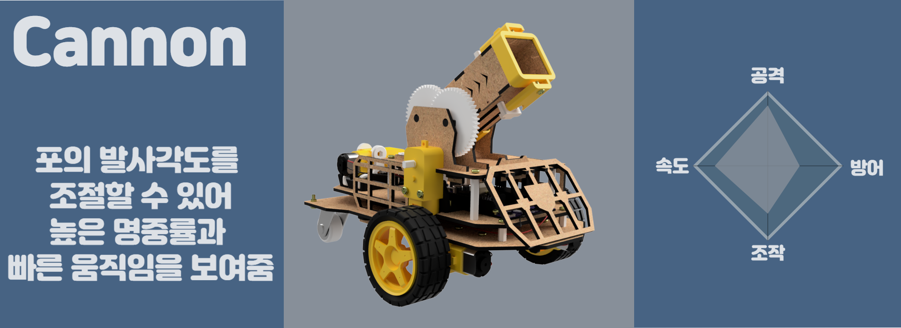

# 아두이노 공성전 시리즈

아두이노 공성전 시리즈에는 현재 총 4개의 캐릭터가 있습니다.

제어하는 방법은 컨트롤러를 통해서 할 수 있으며, 블록 앱은 초기에 쉽게 코딩을 배우기 위한 앱이지 완성 키트를 다루는 앱은 아닙니다.

기본적인 단계별 소스는 동일합니다.

Controller 최종소스만 캐릭터마다 다소 다르며, Blockly 최종소스는 단계별 학습과 동일한 모드로 생각하시면 되기에 다 동일합니다.

[STEP SOURCE](./step_source)

## 캐릭터 소개

가장 먼저 만들어진 캐릭터 중 하나로, 중세시대의 투석기를 보고 만들어진 캐릭터 입니다.

전차 모양을 기반으로 만들어진 캐릭터 캐논입니다. 캐논은 추후에 전차처럼 궤도바퀴로 변경될 수도 있습니다.

스파이더 다리를 가지고 있는 스파이더 캐논입니다. 편하게 스파이더라도 부르도록 하겠습니다. 거미처럼 8족 보행을 보여줌으로서 다른 교구들하고는 구동 모습이 달라 새로운 흥미를 느낄 수 있습니다.

중세시대의 공성무기인 발리스타를 착안하여 만든 캐릭터입니다.

공성용 화살을 발사하여 상대에게 큰 데미지를 입힐 수 있습니다.

